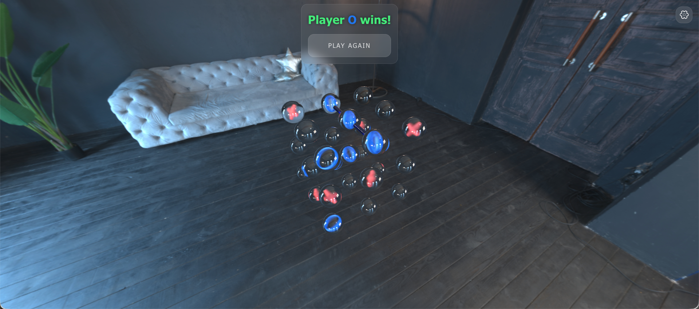

# 🎮 3D Tic-Tac-Toe

A 3D implementation of the classic Tic-Tac-Toe game built with Angular and Three.js, providing an immersive and interactive gaming experience in three-dimensional space.



## 🌐 Live Demo

[Play the game here](https://contact2mayurkukadiya.github.io/3d-tic-tac-toe/)

## 🛠️ Tech Stack

- **Framework**: Angular 19
- **Language**: TypeScript
- **3D Graphics**: Three.js
- **Styling**: Tailwind CSS
- **Build Tool**: Angular CLI
- **Testing**: Jasmine + Karma

## 💻 Development

### 📋 Prerequisites

- Node.js (v18 or higher)
- npm or yarn

### 📦 Installation

1. Clone the repository:
```bash
git clone <repository-url>
cd 3d-tic-tac-toe
```

2. Install dependencies:
```bash
npm install
```

### 🚀 Development Server

To start a local development server, run:

```bash
npm start
```

Or:

```bash
ng serve -o
```

Once the server is running, open your browser and navigate to `http://localhost:4200/`. The application will automatically reload whenever you modify any of the source files.

## 🏗️ Building

To build the project for production, run:

```bash
npm run build
```

Or:

```bash
ng build
```

This will compile your project and store the build artifacts in the `dist/three-tic-tac-toe` directory. By default, the production build optimizes your application for performance and speed.

## 🧪 Testing

To execute unit tests with the Karma test runner, use the following command:

```bash
npm test
```

Or:

```bash
ng test
```

## 🚀 Deployment

To deploy the application to GitHub Pages, first build the project and then use the angular-cli-ghpages package:

```bash
ng build --configuration production
angular-cli-ghpages --dir=dist/three-tic-tac-toe/browser
```

## 🛠️ Code Scaffolding

Angular CLI includes powerful code scaffolding tools. To generate a new component, run:

```bash
ng generate component component-name
```

For a complete list of available schematics (such as `components`, `directives`, or `pipes`), run:

```bash
ng generate --help
```

## 📚 Additional Resources

- [Angular Documentation](https://angular.dev/)
- [Three.js Documentation](https://threejs.org/docs/)
- [Tailwind CSS Documentation](https://tailwindcss.com/docs)
- [Angular CLI Overview](https://angular.dev/tools/cli)
